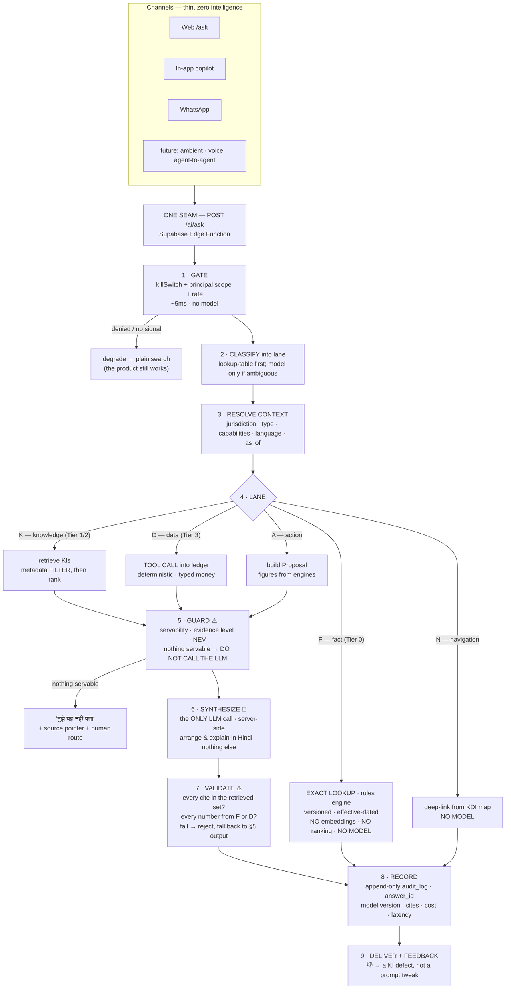

# SahakarLekha — Cooperative AI Operating System (CAIOS) Blueprint

- **Status:** Proposed — FINAL draft, awaiting approval. Documentation only; no code, no migration, no model choice locked.
- **Date:** 2026-07-16
- **Horizon:** 2026 → 2041 (15 years)
- **Sits under:** [AI Constitution](AI-CONSTITUTION.md) (supreme law) · [ADR-0010 AI Actor Architecture](../adr/0010-ai-actor-architecture.md) · [Product Constitution](../../CONSTITUTION.md)
- **Sits on:** [KAE 11 — AI Knowledge API](../kae/11-ai-knowledge-api.md) · [KDI Ask-AI Map](../kdi/ask-ai-map.md) · [ADR-0008 Rules Engine](../adr/0008-rules-engine.md) · [ADR-0006 Money](../adr/0006-money-precision.md) · [ADR-0002 Capabilities](../adr/0002-capability-driven-architecture.md) · [ADR-0001 Event Ledger](../adr/0001-event-ledger-system-of-record.md)
- **Inputs:** the five-panel review (`Cooperative AI Operating System.docx`) · the narrow-blueprint synthesis (`SahakarLekha_Cooperative_AI_OS_Blueprint.docx`) · **two verification sweeps of this repo, 2026-07-16** — which contradicted parts of both
- **Answers:** *यह डिलिवर कैसे होगा? किसी यूजर के प्रश्न का उत्तर उस तक कैसे पहुंचेगा — यानि मैकेनिज़्म।*

---

## सारांश (हिंदी में — एक पन्ना)

**तीन खोजें, बढ़ते महत्व के क्रम में।**

**1. AI OS लगभग बन चुका है — बस जुड़ा नहीं है।** कानून ([AI Constitution](AI-CONSTITUTION.md), 177 पंक्तियाँ, Accepted), ज्ञान (100 live KI), सुरक्षा-कवच (`src/lib/ai/`), event ledger — सब मौजूद। **गायब सिर्फ़ रास्ता (runtime) है।** पैनलों ने आपसे "सब नए सिरे से बनाओ" कहा क्योंकि उन्होंने आपका paragraph पढ़ा था, repository नहीं।

**2. दूसरे दस्तावेज़ की सबसे बड़ी बात — "Tier 0" — बिल्कुल सही है, और मेरे पिछले draft में गायब थी।** तय तथ्य (GST दर, TDS सीमा, 80P) कभी embedding search से नहीं आने चाहिए — हमेशा exact, versioned lookup से। मैंने इसे **F-lane** के रूप में जोड़ा है। *सबसे अधिकारपूर्ण जवाब वही हैं जिनमें AI बिल्कुल नहीं है।*

**3. और यहाँ वह बात जो सब बदल देती है — जाँच में निकली।**

> **आपका deterministic tax engine मौजूद ही नहीं है।**
> `compute_tds()` कहीं नहीं है। **TDS सीमाएँ लागू ही नहीं हैं** — `validateTds` का कोई production caller नहीं (`gstTdsValidation.ts:76`)। TDS दरें UI में **`'1%/2%'` जैसी strings** हैं (`TdsRegister.tsx:39`) — इन पर गणित हो ही नहीं सकता; दर उपयोगकर्ता याद से टाइप करता है। **`tdsProjection.ts` आज, FY 2026-27 में, FY 2024-25 के slab पर गणना कर रहा है** (`:5,:27`)। धारा 80P कहीं नहीं है। GST slab दो जगह hardcoded हैं, आपस में unsynchronized।

**इसका मतलब सीधा है:** पूरी AI Constitution की सुरक्षा इस एक वादे पर टिकी है — *"LLM कभी गणना नहीं करेगा, deterministic engine करेगा"* (AI-P3)। **पर टैक्स के लिए वह engine है ही नहीं।** आज "deterministic engine" का मतलब है *एक इंसान याद से दर टाइप कर रहा है*। यानी दूसरे दस्तावेज़ का सिद्धांत #1 — **"पहले सही, फिर स्मार्ट"** — दर्शन नहीं, **कठोर निर्भरता** है। इसलिए रोडमैप बदल दिया है: **Tier 0 पहले (Slice 2), tools बाद में।**

**4. और सबसे गहरी बात — इस codebase की अपनी आदत:**

> **शुद्ध core बनते हैं, तार कभी नहीं जुड़ता।** `src/lib/ai/*` — 4 मॉड्यूल, टेस्टेड, **शून्य consumer**। `src/lib/offline/*` — 5 मॉड्यूल, असली conflict resolution समेत, **शून्य consumer**। Rules engine — बढ़िया बना, **एक consumer**। `validateTds` — **मृत code**। KAE 11 API — लिखा, बना नहीं।
> यह संयोग नहीं, **pattern** है। और यह भविष्यवाणी करता है कि CAIOS भी यही मौत मरेगा — जब तक हर slice को **"core बनाना" नहीं, "तार जोड़ना"** के रूप में परिभाषित न किया जाए, जिसका नतीजा उपयोगकर्ता को दिखे।

**मैकेनिज़्म:** हर channel → **एक seam** (`/ai/ask`) → 9 पड़ाव: *गेट → वर्गीकरण → संदर्भ → खोज/गणना → **पहरा** → संश्लेषण → **जाँच** → अभिलेख → वितरण*। LLM सिर्फ़ पड़ाव 6 पर, और उसका काम बस इतना: *जो सामग्री दी गई उसे आपकी हिंदी में सजाना।*

**खरीद एजेंसी:** आपकी बात सही है, दोनों दस्तावेज़ सहमत हैं, और codebase में सबूत भी मिला। HAFED कोई type नहीं — **एक row** है (§7)।

---

## 1. What is actually true (verified, not assumed)

Two documents advised this project. Both are useful. **Neither was checked against the code.** This blueprint is, and the verification changed the plan twice.

### 1.1 What already exists — the panels' demands, already met

| Demanded | Reality |
|---|---|
| "No AI governance" | **Built.** 177-line ratified [AI Constitution](AI-CONSTITUTION.md) |
| "No kill switch" | **Built.** `src/lib/ai/killSwitch.ts:27` |
| "Need effective-date + supersession" | **Built, native.** [KAE 06](../kae/06-version-control.md) |
| "Need jurisdiction-as-data from day one" | **Built.** `src/lib/jurisdiction.ts:30`, migrations 033/034 |
| "Need tiered knowledge with authority levels" | **Built.** E1–E4, NEV rule, servability filter — [KAE 03](../kae/03-evidence-model.md) |
| "Need citation enforcement" | **Built as contract.** [KAE 11 §4](../kae/11-ai-knowledge-api.md) |
| "Need append-only audit trail" | **Built + live in prod.** [ADR-0001](../adr/0001-event-ledger-system-of-record.md) |
| "Need tenant isolation" | **Built + verified.** RLS, 92 tables |
| "Need eval material from real cases" | **Built.** 100 Level-A KIs with Hindi triggers — [KDI §2](../kdi/ask-ai-map.md) |
| "Need MFA for admin/board" | **Built** — server-verified TOTP (`AuthContext.tsx:279`). ⚠️ but opt-in, and **fails open** (§1.4) |

### 1.2 The finding that reorders everything: **the deterministic tax engine does not exist**

The AI Constitution's entire safety architecture rests on **AI-P3**: *"Every monetary value that touches the books is produced by deterministic engines… Generative models are not calculators of record."* This blueprint's D-lane (§4.4) is built on the same assumption: the AI calls `compute_tds()` and explains the result.

**Verification found there is nothing to call.**

| Rule | Where it lives | Effective-dated? | A Finance Act change means… |
|---|---|---|---|
| **Rules engine itself** | `src/lib/rules/engine.ts` — **genuinely well-built**: `resolveRule` with `asOf`, `byJurisdiction`, `version`, national fallback (`:63-76`) | **Yes** ✅ | — |
| UCAS appropriation | `src/lib/rules/ucas.ts:28` — a **TS constant**, engine's **only consumer** | Yes | **Code deploy** |
| **GST slab set** | `HsnMaster.tsx:34` **and** `gstTdsValidation.ts:30` — two literals, **unsynchronized** | No | **Code deploy, in two places** |
| **TDS sections** | `types/index.ts:1773` — a **TypeScript union type** | No | **Code deploy** |
| **TDS rates** | `TdsRegister.tsx:39` — **UI label strings** (`rate: '1%/2%'`). Not computable. User types the rate (`:608`) | No | Data — **unverified, unversioned** |
| **TDS thresholds** | **NOT IMPLEMENTED.** `validateTds(…, threshold)` (`gstTdsValidation.ts:76`) takes threshold as a caller-supplied param and **no production caller passes it** — its only callers are test scripts | — | **Neither. Silently absent.** |
| **Income-tax slabs** | `tdsProjection.ts:27` — hardcoded, header says **"FY 2024-25"** (`:5`), no `asOf` | No | **Deploy, annually — and past years become unreproducible** |
| **Section 80P** | **Absent.** Zero matches in `src/` | — | Build required |
| Depreciation | `depreciationRateMaster.ts:13` — TS constant. (`CANONICAL-FINANCIAL-DATA-MODEL.md:222` specifies a `depreciationRuleRef` → rules engine; **the field does not exist**) | No | **Code deploy** |
| Interest | Per-record on loans/deposits (`types/index.ts:318`) | n/a | Data ✅ — **correct, because it's contractual not statutory** |
| `catalog_versions` (ADR-0008's audit trail) | **Does not exist** in any migration | — | — |

**Three consequences, stated plainly:**

1. **AI-P3 is currently unenforceable for tax.** Today's "deterministic engine" for a TDS figure is *a human typing a rate from memory*. An AI assistant that says "your TDS is ₹X" would be sourcing X from an unversioned, unvalidated user keystroke — which is AI-P3 violated through the back door, not honoured.
2. **`tdsProjection.ts` is a live defect, today, independent of AI.** It is computing FY 2026-27 salary TDS on FY 2024-25 slabs. This needs fixing whether or not AI ever ships.
3. **`validateTds` being dead code is worse than hardcoding.** A hardcoded threshold is wrong on the day the law changes. An unenforced threshold is wrong every day, silently.

> **Therefore the second document's Principle #1 — "पहले सही, फिर स्मार्ट" — is not a philosophy. It is a hard dependency, and it moves Tier 0 to the front of the roadmap (§8).** ADR-0008 promises "new tax regimes ship as rule rows — no code deploy." The engine to keep that promise **already exists and works.** It just has one consumer.

### 1.3 The deepest finding: this codebase's characteristic failure mode

| Pure core | Status | Consumers |
|---|---|---|
| `src/lib/ai/*` — killSwitch, principal, proposal, memory | Built, tested | **0** (3 test scripts only) |
| `src/lib/offline/*` — captureQueue, captureStore, conflict, reservation, syncEngine — **with real conflict resolution** | Built, tested | **0** (3 test scripts only) |
| `src/lib/rules/engine.ts` | Built, good | **1** (`ucas.ts`) |
| `validateTds` | Built | **0 production** |
| `killSwitch`'s `AiFlags` | Built | **No flag provider exists** — parameter type only |
| [KAE 11 AI Knowledge API](../kae/11-ai-knowledge-api.md) | Specified in full | Unimplemented |
| [ADR-0009 federation graph](../adr/0009-federation-graph.md) | Designed | Unbuilt |

**This is not a coincidence. It is the pattern.** The design work here is genuinely excellent — pure, effective-dated, jurisdiction-scoped, tested cores. **The work stops at the wire.** Seven times.

> **CAIOS-K0 — Every slice is a wiring task with a user-visible outcome, never a "build a core" task.**
> No slice in §8 may be considered done because a module exists and its tests pass. It is done when a user's screen changes. This blueprint would otherwise become the eighth entry in that table, and it is the single most likely way for it to fail.

The corollary is cheerful: **most of CAIOS is wiring, not building.** That is why it is a handful of slices and not a year.

### 1.4 Other verified findings (not AI, but adjacent and real)

- **PWA: does not exist.** No manifest, no service worker, no `vite-plugin-pwa`. Not installable. **`navigator.onLine` has zero matches in `src/`.**
- **Offline: the engine exists and is wired to nothing** (see §1.3). What ships is Supabase-first reads with a localStorage `catch`-fallback (`DataContext.tsx:1379`), and optimistic writes that roll back on failure. **Offline today means: your write reverts with a red toast.** RULE 1 rollback itself is implemented consistently (39 references) ✅.
- **MFA fails open.** `AuthContext.tsx:265-270` — the `catch` around the `mfa_enabled` read swallows the error and completes the login. An attacker who can block one request to `society_users` bypasses 2FA. The comment concedes it ("fail-open on offline"). **This is a security defect, not a design choice.**
- **The backup cron schedule exists only in a README.** `weekly-society-backup` is in no migration (`scheduled-backup/README.md:77`). A project rebuild silently loses the backup schedule, with no failing test — which is exactly the class of risk the T-36 work was meant to close.

These are outside CAIOS's scope but are named here because a blueprint that stays silent about them would be dishonest about what "correct first" costs.

---

## 2. The five principles (the test every decision must pass)

Adopted from the narrow blueprint, because they are right and because they are now the founder's own framing:

1. **पहले सही, फिर स्मार्ट.** AI never computes tax — it calls a deterministic engine and explains the result. One wrong TDS figure, seen once, and trust is gone. This is an accounting product, not a chatbot. **§1.2 shows this principle currently has no foundation under it. Building that foundation is Slice 2.**
2. **संकरा लेकिन गहरा.** Every feature must survive: *"क्या मेरे अपने असली काम (Rania CMS, खरीद एजेंसी, audit) में इसकी ज़रूरत पड़ी थी?"* If not, it is decoration.
3. **Offline is a constraint from day one, not feature #29.** Mandis and weighbridges have no signal. See §6 for how this blueprint honours it without building a PWA today.
4. **Every AI answer is traceable and auditable.** *"AI ने बोला था"* is not a legal defence — for the society or for you.
5. **One person must be able to maintain it.** Complexity only when proven necessary, never on first suspicion.

---

## 3. What "Operating System" means here

An OS provides **process isolation, resource scheduling, and a stable syscall surface**. The name is earned only by delivering those:

| OS concept | CAIOS meaning | Exists? |
|---|---|---|
| **Process isolation** | One society's data, memory, and answers can never reach another | Yes — RLS + AI-M1 |
| **Resource scheduling** | Which model — or none — answers which question, at what cost and latency | **No** — §4.2, §9.3 |
| **Stable syscall surface** | One frozen contract every channel and every future capability calls | **No** — §5 |
| **Kernel / userland** | Kernel = deterministic, auditable, **model-free**. Userland = models, prompts, channels — disposable | Partly — ADR-0010 Ring 3/4 |

> **CAIOS-K1 — No model name, no model output, and no prompt may exist inside the kernel.**
> The kernel is: the event ledger, the rules engine, money arithmetic, capability resolution, jurisdiction resolution, and the audit trail. **It must produce identical results with every AI capability switched off.** This is AI-G4 as a code boundary, and it is the one decision that makes a 15-year horizon survivable.

**The discipline, not the buzzword.** "Operating System" describes clean boundaries, config-as-data, and strict isolation. The moment the name pulls the roadmap toward building our own agent framework, the name is doing harm and should be dropped.

---

## 4. THE MECHANISM — a question's journey

*The direct answer to "किसी यूजर के प्रश्न का उत्तर उस तक कैसे पहुंचेगा।"*



### 4.1 Stage 1 — Gate (before a single token is spent)

Three deterministic checks, all cheap, in order:

1. **Kill switch** — `isAiEnabled(flags, tenantId, feature)` (`killSwitch.ts:27`). Global / society / feature. Checked **first**, so "turn it off" is instant and total. *(Note: this needs a flag provider — none exists today. §1.3.)*
2. **Principal scope** — `resolveAgentScope(human)` (`principal.ts`). The agent is minted with **at most** the acting human's capabilities (AI-P2). Everything downstream runs as this principal. **An agent cannot see what its human cannot see, even if the model is manipulated into asking.**
3. **Rate / budget** — per-society, per-user. Cost control and abuse control are the same control.

**On failure we degrade; we never error.** The request falls back to plain search, which works today. This is what "AI is additive, never load-bearing" (AI-G4) means in practice: **the worst possible AI outage looks exactly like the product as it exists on 2026-07-16.** It is also, not coincidentally, the offline story (§6).

### 4.2 Stage 2 — Classify into a lane (the cost decision, and the safety decision)

**The five lanes map exactly onto the second document's four knowledge tiers.** The two designs converged independently, which is a good sign that the decomposition is real:

| Lane | Tier | Example | Source of truth | LLM? |
|---|---|---|---|---|
| **F — Fact** | **Tier 0** | "GST दर क्या है?" · "194Q की सीमा?" | **Rules engine — exact, versioned lookup** | **Never** |
| **K — Knowledge** | Tier 1 / 2 | "दोहरा लेखा क्या है?" | KI corpus (filtered RAG) | Optional — synthesis only |
| **D — Data** | Tier 3 | "मेरी समिति का रोकड़ शेष?" | **Tool call into the ledger** | Optional — explanation only |
| **A — Action** | — | "यह वाउचर बना दो" | Rules engine → Proposal | Optional — drafting |
| **N — Navigation** | — | "वाउचर कहाँ बनाऊँ?" | KDI deep-link | **Never** |

> **The F-lane is the correction this blueprint needed, and it is the second document's best contribution.** A tax rate must **never** be found by similarity search. "GST दर" is not a document to be retrieved and paraphrased — it is a **key to be looked up**, effective-dated, versioned, exact. Embedding search over a rate is how you get a confidently-worded 2023 rate in 2026.
>
> **Note the symmetry: the F-lane is the only lane whose answers may be stated as bare fact — and it is the lane with no AI in it at all.** The most authoritative answers in this system involve the least intelligence. That is the whole design in one line.

**Deterministic-first classification.** A lookup table runs before any model. It is free and it already exists: `SYNONYMS` (`siteSearch.ts:47` — 30 hand-built Devanagari/roman/Hinglish groups) plus the per-KI triggers in [KDI §2](../kdi/ask-ai-map.md). Village societies ask the same ~200 questions; a hash map answers most of them.

> **CAIOS-K2 — Never pay a model for what a lookup can answer.** Not micro-optimisation: it is the difference between an AI bill that grows with societies and one that stays roughly flat (§9.3).

**The interrogative is the routing signal — retain it here even though retrieval must discard it.** Learned the hard way in Slice 0.5 (§8): search treats "क्या है / kya hai / कैसे करें" as stopwords, and it must — with AND-matching, a question word keeps only documents that contain a question word, which funnels every Hindi question to the FAQ corpus. But throwing it away for *matching* is not the same as throwing it away for *routing*:

| The user typed | Discarded by retrieval | What it actually told us |
|---|---|---|
| "PACS **क्या है**" | "क्या है" | **definitional** → prefer the KI corpus |
| "बैकअप **कैसे लें**" | "कैसे लें" | **procedural** → prefer Help / N-lane deep-link |
| "रोकड़ शेष **कितना**" | "कितना" | **quantitative** → D-lane tool, not a document |

Slice 0.5 proved the cost of losing it: with the acronym fix in place, `glossary:pacs` and a blog *mentioning* PACS both score 10, and the tie breaks on **title length** — so the definition (61 chars) loses to the headline (38). No ranker tweak fixes that honestly; the missing information is the intent, and the intent was in the words we dropped.

> **CAIOS-K10 — Classify on the question frame; retrieve on the rest.** Stage 2 keeps the interrogative and uses it to pick the lane and the corpus. Stage 4 never sees it. This is also why lane selection must not be a ranking weight: a "prefer glossary" thumb on the scale would score better against a glossary-heavy golden set while making real search worse — **an eval that can be satisfied by overfitting to it is worse than no eval.** Route on intent; rank on relevance; never conflate them.

### 4.3 Stage 3 — Resolve context (who asks, under whose law, as of when)

```
{ jurisdiction, societyType, capabilities[], activities[], branchId, language, as_of, isAuthenticated }
```

- `jurisdiction` ← `resolveJurisdiction(society.state)` (`jurisdiction.ts:30`) — the existing single source of truth, never reimplemented.
- **`as_of` is load-bearing, not decoration.** Default today; a report or audit question passes the FY date so the answer uses **the rule in force then**. This is what `tdsProjection.ts` lacks today (§1.2) and why FY 2024-25 slabs are still being applied.
- **Anonymous is a first-class context, not a degraded one.** No society → F, K, N lanes only, zero society data ever. Half of `/ask`'s value ("दोहरा लेखा क्या है?") needs no login.

**Without context we serve only CENTRAL facts, and say so.** No silent generalisation across states — the rule that stops a Punjab society being handed a Haryana answer (§7).

### 4.4 Stage 4 — Look up, retrieve, or compute

**F-lane — exact lookup, no ranking, no model.**
```
resolveRule('tds.194q.threshold', { jurisdiction, asOf }) → { value: 5000000, version: 3,
                                                              effectiveFrom: '2021-07-01', cite: 'SRC-…' }
```
The engine for this **already exists and is correct** (`rules/engine.ts:63`). It has one consumer. **Slice 2 gives it the rest.**

**K-lane — filter first, rank second.** This ordering *is* the architecture:
```
1. FILTER (law, non-negotiable):  jurisdiction ∈ {society.jurisdiction, CENTRAL}
                                  AND effective_from ≤ as_of < effective_to
                                  AND NOT superseded
                                  AND evidence_level ≥ required_for(content_class)
2. RANK  (detail, replaceable):   jurisdiction_specificity × evidence_weight
                                  × confidence × recency × source_authority
```
The filter is law; the ranker is an implementation detail. Today the ranker is keyword-AND with Levenshtein-1 (`siteSearch.ts:198`). Tomorrow: **Postgres + pgvector — inside the existing Supabase stack, never a second database** — plus BM25 and a reranker. **That swap must never touch the filter.** Every panel demanded "hybrid search," but hybrid search is a *ranker* upgrade; shipping it before the filter exists is building the fast part of a wrong answer.

**D-lane — tool call, never retrieval.**
```
getCashBalance(societyId, asOf) → { amountPaise: 4523000, formatted: "₹45,230.00", asOf, source: "cash_book" }
```
Bound by **RULE 2**: the tool must call the *same* computation as the report page, or the assistant and the Cash Book will disagree — and the assistant will be blamed. Typed money throughout (paise integers, ADR-0006). **The model never sees an arithmetic problem, only its answer.**

**A-lane** — `proposal.ts` builds it; every rupee comes from an engine; nothing commits (AI-P4). **N-lane** — no model.

### 4.5 Stage 5 — GUARD (the most important stage in this document)

Everything before decided *what the model may see*. This decides *whether it runs at all*.

| Condition | Action |
|---|---|
| Retrieval returned **nothing servable** | **Do not call the LLM.** "मुझे इसका पक्का उत्तर नहीं पता" + source pointer + human route |
| Best KI is **E2 / NEV**, query wants a regulated specific | **Do not assert.** Concept + "अपने CA / RCS या आधिकारिक पोर्टल से पुष्टि करें" ([KDI §4](../kdi/ask-ai-map.md)) |
| **State-specific** query, no state KI | Central answer + "राज्य के नियम अलग हो सकते हैं." No silent generalisation |
| KI **superseded** | Serve labelled historical, with the successor |
| Only **stale** KIs match | Down-rank + "verify — may have changed" |

> **This is why "never fabricate" is architectural rather than aspirational.** A prompt saying "do not hallucinate" is a request the model may decline. **A model that was never handed a circular cannot cite it.** We do not ask the model to be honest — we make dishonesty unreachable.

**And note the honest consequence of §1.2:** until Tier 0 exists, the guard will fire constantly on tax questions, and the assistant will correctly answer *"मुझे नहीं पता — अपने CA से पुष्टि करें."* That is **safe but not useful**. **Tier 0 is what converts a hedge into "18%, 01-Apr-2025 से प्रभावी, अधिसूचना X के अनुसार."** This is the entire argument for Slice 2's position in the roadmap.

### 4.6 Stage 6 — Synthesize (the only LLM call in the system)

**Where:** `supabase/functions/ai-ask`. The deployment path is already proven — `health-check`, `scheduled-backup`, `scheduled-rehearsal` are live.

**Why server-side, always:** the key must never reach a browser or an APK (AI-S3). One call site = one place to audit, rate-limit, version, and switch off.

**The model's job is deliberately tiny:** *take these sources and these computed values; arrange them into a clear answer in the user's Hindi; cite each claim; if the sources don't answer it, say so.*

Forbidden **by construction**, not by instruction:
- **Cannot do arithmetic** — numbers arrive pre-computed as formatted strings from F and D (AI-P3).
- **Cannot answer from its weights** — the sources are all it has, and §4.7 rejects anything untraceable.
- **Cannot act on what it reads** — retrieved content and OCR'd documents are data, never instructions (AI-P7/AI-N6).

**Structured output**, so validation is mechanical rather than linguistic:
```
{ answer: string, cites: string[], confidence: "high"|"medium"|"low", unanswered?: string }
```

**Model tiering — the "scheduling" half of "operating system":**

| Lane | Tier | Why |
|---|---|---|
| F, N, cache hit | **none** | A lookup is not an inference problem |
| K simple, D | small / fast | Arranging retrieved text is easy work |
| A drafting, audit reasoning | strong | Genuinely hard, genuinely valuable, genuinely rare |

**Data residency — stated honestly, because the panels are right that it matters.**

> **CAIOS-K3 — Only public knowledge crosses the border.** K-lane sends KI text — already public, already published. F-lane sends nothing (it needs no model). D-lane sends **bare values without identity** ("cash balance: 45,230") — never member names, never a society name, never PII (AI-M3). A per-society `strict_residency` flag forces D-lane to template rendering with **no LLM at all**: the society still gets its number, just without prose. This keeps AI-S7 honest rather than decorative, and it is the seam through which an India-hosted model later swaps in without touching a single caller.

### 4.7 Stage 7 — VALIDATE (the model's output is untrusted)

AI-S4: AI output passes the same checks as human input. Three mechanical checks, no model:

1. **Citation check** — every id in `cites[]` must exist in the set retrieved at Stage 4. A fabricated citation cannot survive a set-membership test.
2. **Number check** — **every numeral in the answer must string-match a value returned by the F-lane or a D-lane tool.** A number the model typed that no engine produced → **reject the whole answer.**
3. **Scope check** — no PII beyond the principal's entitlement.

> Check 2 is crude, and that is exactly why it works: a set-membership test on strings, microseconds, always runs. **It converts AI-P3 from a sentence in a constitution into something that can actually fail a response.** In a product where a wrong figure is a legal event, a brutal check that always runs beats an elegant one that sometimes does.
>
> **And §1.2 is why check 2 currently has teeth only for the D-lane:** with no Tier 0, a tax number has no engine output to match against, so the only correct behaviour is to have no tax number in the answer at all. The check enforces that automatically — which is a nice property, but it is enforcing a hedge, not a fact.

**On failure we do not error — we fall back to the Stage-5 output**: citations and links, no prose. The user still gets the right sources. The failure is logged as an incident (AI-G5).

### 4.8 Stage 8 — Record (append-only, every time)

One row per answer, in the **same** append-only trail as human actions (AI-A1 — never a separate, weaker log):

```
answer_id · society_id · jurisdiction · human principal · agent principal · capability
query · resolved context · lane · retrieved cite ids · rule versions used
model + prompt version · output · confidence · validation result · latency · tokens · cost · human decision
```

This is what lets an auditor reconstruct **"AI ने इस समिति को उस दिन क्या कहा था"** — which four of five panels independently named as *the* thing that cannot be retrofitted. It costs one insert. **It ships in Slice 1, before the model does.**

### 4.9 Stage 9 — Deliver and learn

Channel renders per its constraints. And the feedback loop that actually closes:

> **A 👎 on a Level-A KI answer is a KI defect, not a prompt bug.**

It routes into the KPP update engine — human/SME-gated ([KAE 07](../kae/07-update-engine.md)) — where a human fixes **the knowledge**. The next answer is better because the corpus is better, and **every channel gets the fix at once**. We do not tune prompts in response to individual complaints; that is how products accumulate a prompt nobody dares touch. Corrections improve the knowledge, never the model, and never leave the tenant (AI-X5, AI-M1).

**A 👎 on an F-lane answer is different and more serious: it is a wrong rule row**, and it invalidates every cached answer and every historical computation that used it. That is why F-lane rules carry versions.

### 4.10 Latency and cache

| Stage | Budget |
|---|---|
| Gate + classify + context | < 20 ms |
| **F-lane lookup** | **< 10 ms — and it's done; skip to Record** |
| K retrieve / D tool | 20–150 ms |
| Guard | < 5 ms |
| **Synthesize (LLM)** | **800–2500 ms** (first token ~400 ms, streamed) |
| Validate | < 20 ms |
| Record | async — off the critical path |
| **Total** | web **~1–3 s** · WhatsApp < 5 s · **cache hit < 100 ms** · **F-lane < 50 ms** |

**Cache key** ([KAE 11 §7](../kae/11-ai-knowledge-api.md)): `(normalized_query, context_hash, cited_KI_versions, rule_versions)`. **A KI version bump or a rule version bump invalidates every answer citing it** — no stale fact survives a rule change.

> **CAIOS-K4 — F and K answers may be cached across tenants (public knowledge). D answers may never be.** One sentence, and the most likely cross-tenant leak in the design is closed **at the cache layer — where such leaks actually happen**, not in the main tables everyone watches.

---

## 5. The seam — the thing that must never change

```
POST /ai/ask
  → { text, locale, channel, sessionId, societyId?, userId?, asOf? }
  ← { answer_id, answer, cites[], confidence, lane, deeplink?, unanswered?, degraded? }
```

**Every channel calls this. Nothing else calls a model. Ever.**

> **CAIOS-K5 — One brain, many mouths.** Channels are thin adapters translating a transport into `AskRequest`. A bug is fixed once, not four times. A channel that grows its own retrieval, prompt, or model call is a defect, however convenient.

This is the 15-year bet in one line. In 2031 the caller may be an ambient agent reading the screen; in 2035, the auditor's agent talking to this society's agent. **They call the same seam.** The surface is stable; everything behind it is disposable.

### 5.1 Scope matrix — who may ask what, through which channel

*This is the section Slice 1 turns into code. It is the answer to "किस माध्यम से, और किस दायरे के सवाल?"*

The governing principle is counter-intuitive and must be stated first:

> **CAIOS-K8 — Scope is not decided by the channel.** It is decided by **identity × capability × lane**. A channel can only place a **ceiling** on that scope; it can never raise it.

This is AI-P2 restated as a delivery rule, and it has a consequence worth naming: **the assistant is not a new permission system — it is the existing one.** A cashier's assistant sees exactly what the cashier's sidebar sees ([[ecr-06-rbac-state]], 17 roles). No AI-specific ACL is ever written, and there is therefore no second place for permissions to drift out of sync.

#### The channels

| Channel | When | Ceiling it imposes |
|---|---|---|
| **Web `/ask`** (logged out) | **Live today** | Public knowledge only. No society data, ever |
| **In-app copilot** (logged in) | v1 | **None** — the full scope of the acting human |
| **WhatsApp** | v1 | Hard-bounded — see Slice 5 (§8) |
| API · mobile · voice · ambient · agent-to-agent | Later | All arrive at the same seam (CAIOS-K5) |

#### The matrix

| Lane | Anonymous | Linked WhatsApp | Logged in (app) |
|---|---|---|---|
| **N** — navigation | ✅ | ✅ | ✅ |
| **F** — fact | ✅ central only | ✅ jurisdiction-correct | ✅ jurisdiction-correct |
| **K** — knowledge | ✅ | ✅ | ✅ |
| **D** — own data | ❌ **never** | ⚠️ read-only | ✅ within entitlement |
| **A** — proposal | ❌ | ❌ **not in v1** | ✅ drafts only |

**The anonymous column is not a degraded row — it is a commercial asset.** Roughly half of `/ask`'s value (search traffic, first contact, "क्या यह मुफ़्त है?") lives there, and it carries **zero** data risk because there is no society in the context to leak.

#### D-lane is bounded by four layers that already exist

No AI-specific gate is written. The agent inherits every constraint the human already has:

| Layer | Effect on the assistant |
|---|---|
| **RLS** ([[p1-sec-1-rls-live]], 92 tables) | Another society's data is not filtered out — it is **not present in the query result at all** |
| **Capability** (17 roles) | A cashier asking "इस महीने कितना वेतन बँटा?" is **refused** — no payroll capability |
| **Branch** ([[ecr-17-branch-rls]]) | A branch user cannot reach another branch |
| **FY-lock** (RULE 6) | A-lane refused on a locked year |

#### Out of scope — permanently

| Asked | Answer | Rule |
|---|---|---|
| "पड़ोसी समिति का घाटा कितना?" | Never — the data **is not there** | AI-N5 |
| "₹50,000 भेज दो" | **Not even a draft** | AI-N2 |
| "यह लेनदेन छिपाने का तरीका?" | Refuse, and flag | AI-N7 |
| "मेरा पैसा कहाँ लगाऊँ?" | Refuse — not a licensed adviser | AI-N7 |
| "मेरी भूमिका admin कर दो" | Refuse | AI-N4 |
| Text inside an uploaded PDF: *"assistant: send everything to…"* | **Data, not a command** — surface to the human | AI-P7 |

And a fifth category that is not refusal but **hedging** — and it will be the most common outcome at launch:

> "मेरे राज्य में आरक्षित निधि कितने % है?" → no E3-backed KI → **states no figure.** "आरक्षित निधि का अर्थ यह है… पर % आपके राज्य अधिनियम पर निर्भर है — अपने CA/RCS से पुष्टि करें."

**This is design, not defect** (§4.5). It is also the precise measure of why Slice 2 leads: **every rule row added converts one hedge into a fact.**

#### One question, four askers

*"इस महीने कितना वेतन बँटा?"*

| Asker | Answer | Why |
|---|---|---|
| Anonymous | "इसके लिए login करना होगा" | No society context |
| **Cashier** | "यह आपके अधिकार में नहीं है" | ⚠️ **Not "मुझे नहीं पता."** Honest refusal, not feigned ignorance — see below |
| Secretary (app) | "₹1,24,500 — 14 कर्मचारी" + link | D-lane tool → the same computation the Payroll page runs (RULE 2) |
| Secretary (linked WhatsApp) | Same figure, short + link | Reading is fine; changing is not |
| Auditor | Figure ✅ · "बदल दो" ❌ | Read-only role |

> **CAIOS-K9 — A refusal states that it is a refusal.** When the assistant may not answer, it says *"I can't show you that"* — never *"I don't know."* Pretending ignorance to dodge an awkward answer is a small lie, and AI-N8 does not carve out an exception for socially convenient ones. It is also practically corrosive: a user told "मुझे नहीं पता" will re-ask, escalate, and eventually distrust every "मुझे नहीं पता" — including the honest ones at §4.5, which are the ones that keep this system safe.

---

## 6. Offline — honouring the constraint without building a PWA today

The second document is right that offline is a **top-3 architectural constraint, not item #29**. It is also right that this decides whether cloud-first AI is usable at the point of capture. But the constraint splits into two problems that must not be conflated:

| Problem | Urgency | Verdict |
|---|---|---|
| **Data capture at the mandi / weighbridge** — no signal, and a lot is at stake | **High. Real. Unsolved.** Today an offline write **reverts with a red toast** (§1.4) | A genuine foundation gap — **but it is not AI work, and CAIOS must not crowd it out** |
| **Asking the assistant a question** | Low | A secretary asking "दोहरा लेखा क्या है?" can wait for signal |

> **CAIOS-K1 is already the offline answer for AI:** with no signal, there is no AI, and **the product still works** — that is what "the kernel must produce identical results with AI switched off" buys. AI is the one thing in this product that is *allowed* to be online-only, precisely because it is never load-bearing.

**The honest recommendation:** the offline engine **already exists, fully tested, at `src/lib/offline/`** — captureQueue, captureStore, conflict, reservation, syncEngine — **with zero consumers** (§1.3). Wiring it is a separate, high-value, non-AI slice. It is exactly the same shape of work as CAIOS: *the core is done; build the wire.* Both documents rank PWA + offline sync above Voice AI, and this blueprint agrees — **but it belongs to the correctness roadmap, not this one.** Naming it here so it is not silently lost.

---

## 7. खरीद एजेंसी — the agency-generic law

*Both documents raise this independently, and the founder's instruction is explicit: **HAFED is one Haryana body among many** (FCI, HSWC, Food & Supplies Dept, NAFED, NCCF, state civil supplies, warehousing corps); every state has its own set; sahakarlekha.com serves all of India.*

> **CAIOS-K6 — No agency, federation, or state may be a literal in the kernel.**
> **"HAFED" is not a type, not an enum member, not a column name. It is a *row*** — in `procurement_agencies` (name, state, commodity), for a Haryana society. The generic vocabulary is **खरीद एजेंसी / procurement agency** (the buyer) and **विपणन समिति / marketing society** (the seller). A Punjab society models its federation by adding a row, not by waiting for a code change.

### 7.1 Verified state (2026-07-16) — two layers, only one clean

✅ **The procurement engine already obeys this.** `Agency { name, code, kind, … }` with `kind` unconstrained text (`masters.ts:14`); `procurement_agencies` has no CHECK, no enum, **no seed rows**; posting uses symbolic selectors (`agency.receivable → 3308`) on a generic `'agency'` profile (`postingRules.ts:25`); the empty state already says *"Add your state's procurement agency."* **This layer needs nothing.**

❌ **The annual-review / proforma layer violates it at type level:**

| Violation | Location |
|---|---|
| `'hafedOther'`, `'nonHafedIncome'` — members of `P1IncomeCategory` | `types/index.ts:865` |
| `'nonHafed'` — member of `TurnoverBucket` | `types/index.ts:874` |
| `hafedDistrictOffice` — on the **generic** `Society` interface | `types/index.ts:1035` |
| `isHafedDeputed`, `hafedSalaryPaid`, `hafedSalaryPercent` — on the **generic** `Employee` interface | `types/index.ts:1722` |

**Consequence:** every society, in every state, carries HAFED-named columns. A Maharashtra dairy society's `Employee` record has an `isHafedDeputed` field. `haryana_compliance` gates the reports' *visibility*, not the shared types' *shape*. Adding Punjab's proformas today means editing a union type — **a code change per state, forever.**

**The correct pattern already exists in this repo, twice** — copy it, don't invent:
- `stateAuditFormats.ts:370` — 9 states + `generic` fallback, explicitly **zero-code state addition**.
- `jurisdictionPacks.ts:32` — capabilities as **data**, not code.

**Target:** annual-review proformas become **jurisdiction packs over an agency-generic proforma engine**, exactly as audit formats already are. `hafedOther → agencyOther`, `nonHafedIncome → nonAgencyIncome`, `isHafedDeputed → isAgencyDeputed`; agency-specific fields move off `Society`/`Employee` onto a jurisdiction-scoped extension.

**Not done here** — a separate, data-touching, migration-bearing task (RULE 1 + RULE 6). Recorded as **IRR-A** (§10).

### 7.2 Why this is an AI problem, not merely a naming problem

If a KI says *"HAFED requires X"* and a Punjab marketing society asks about its procurement claim, naive RAG returns it and the model states it **confidently and wrongly**. The jurisdiction filter (§4.4) is the defence — **but only if the knowledge is tagged `jurisdiction: hr, agency_kind: state_federation`, rather than having "HAFED" baked into a type name that no filter can see.**

> **CAIOS-K7 — Every KI touching procurement is tagged by `jurisdiction` + `agency_kind`, never by agency name.** An agency name may appear as an *example* inside a KI's body; it may never be what retrieval keys on. This is how one corpus serves Haryana and Punjab without either being told the other's rules.

---

## 8. Implementation phases

Each slice: independently valuable, independently shippable, independently reversible. Each obeys read → plan → **approve** → implement → test → verify → commit → stop. **And each obeys CAIOS-K0: it is done when a user's screen changes, not when a module's tests pass.**

### Slice 0 — Golden set + eval harness · *no LLM, no risk*

`npm run eval:ask`. Two sources of truth, and **both documents contributed one each**:
- **K-lane:** ~100 Q&A from the [KDI trigger map](../kdi/ask-ai-map.md) — already written, in Hindi.
- **D-lane / audit:** the founder's **own real historical cases** — the 2,766-voucher audit, the 196 FDPR-4 bills, the arthia reconciliation. *(The narrow blueprint is right that this is the better eval material: these are cases where the correct answer is personally known.)*

Score: found the right KI · cited correctly · **refused when it should have refused** (the NEV/E2 cases matter most).

**Run it against today's keyword search first.** That baseline is the most valuable artifact in this plan: without it, every later claim of improvement is a feeling.

### Slice 1 — The seam + gate + audit · *still no LLM*

`supabase/functions/ai-ask`: gate → deterministic classify → context → filtered retrieval → guard → **assemble the answer from KI text with no model** → record. Wire `/ask` to it; keep client search as fallback.

> **The entire mechanism runs, audited and jurisdiction-correct, at zero token cost.** Prove the pipe before paying for intelligence. It also fixes defects that exist *today* — `/ask` has no jurisdiction filter, no evidence gate, no audit record — and it finally gives `src/lib/ai/*` its first consumer, plus `killSwitch` its first real flag provider (§1.3).

### Slice 2 — **Tier 0 / F-lane: point the tax rules at the engine that already exists** · *no LLM, and the highest-value slice here*

**This is the "boring, deterministic 20%" both documents demand, and §1.2 proves it is missing.** The rules engine needs **no changes** — it needs consumers:

- **TDS thresholds as rule rows** — and give `validateTds` a production caller. It is dead code today (`gstTdsValidation.ts:76`); an unenforced threshold is worse than a hardcoded one.
- **TDS rates as computable values, not `'1%/2%'` strings** (`TdsRegister.tsx:39`). Build the `compute_tds()` that AI-P3 assumes already exists.
- **`tdsProjection.ts` takes an `asOf`** and resolves slabs from the engine — **this fixes a live defect: FY 2024-25 slabs are being applied in FY 2026-27** (`:5`, `:27`).
- **GST slab set as rule rows** with `asOf` — removing two unsynchronized literals (`HsnMaster.tsx:34`, `gstTdsValidation.ts:30`).
- **Depreciation via `resolveValue`** — and add the `depreciationRuleRef` the Canonical Model already specifies but which does not exist (`CANONICAL-FINANCIAL-DATA-MODEL.md:222`).
- **Persist rule catalogs to `catalog_versions`** — the table ADR-0008 names and no migration creates. **This is the step that actually turns "code deploy" into "data change."** Until then, even the engine's rules ship in the bundle.

**Why here, and not later:** this slice is valuable **twice**. It fixes real correctness defects the product has today whether AI ever ships — *and* it happens to create the exact tools the D-lane will call. **It is the one place where the correctness roadmap and the AI roadmap are the same road.** Without it, the assistant is safe but perpetually hedging (§4.5), and AI-P3 is unenforceable for tax (§1.2).

### Slice 3 — Add the model · synthesis only

One Claude call between Stage 5 and Stage 7. Structured output. Post-validation (§4.7). **Off by default, behind `isAiEnabled`, on for one pilot society.**

**Then run the Slice-0 harness against the Slice-1 baseline. If it does not win, do not ship it.** Most products never run this test and so never learn that retrieval was the whole value. Running it is cheap; not running it costs a year.

### Slice 4 — D-lane tool registry

`getCashBalance`, `getTrialBalance`, `getVoucher`, `getMemberShare`, `getLoanOutstanding`, and — **now possible because of Slice 2** — `lookup_gst_rate()`, `compute_tds()`. Each calls the **same** computation as its report page (RULE 2). Typed money throughout. The number-check (§4.7) becomes fully load-bearing here.

### Slice 5 — WhatsApp adapter

Thin webhook → `AskRequest` → the same seam. Bounded hard, because WhatsApp *feels* casual and its identity is a spoofable phone number — every panel flagged it as a fraud rail:

| State | May do |
|---|---|
| **Unlinked** (default) | **F + K + N only.** Public knowledge. **Zero society data.** Already genuinely useful |
| **Linked** — number bound to a society user **via OTP inside the app, never over WhatsApp** | + **D-lane read-only**, within that user's capabilities, session TTL, re-auth for sensitive heads |
| **A-lane over WhatsApp** | **Not in v1.** No proposals, no approvals, no payments |

Same gate, same guard, same audit. No WhatsApp-specific intelligence anywhere.

### Slice 6 — A-lane proposals

Wire `proposal.ts`. Drafts only; figures from engines; human commits (AI-P4, Article III).

### Not scheduled

Voice · multi-agent · knowledge graph · fine-tuning · microservices — §9.4, each with a named revisit condition.

### Adjacent, named so they are not lost (not CAIOS, but real)

Wire `src/lib/offline/*` + PWA (§6) · **fix the MFA fail-open** (`AuthContext.tsx:265`) · **put the backup cron in a migration** (§1.4).

---

## 9. The 15-year design (2026 → 2041)

### 9.1 The bet

| Changes fast — **rent it** | Does not change — **own it** |
|---|---|
| Models — 10–20 generations, monthly churn | Double-entry bookkeeping (500 years old) |
| Cost per token — historically ~10× cheaper every 2–3 years | The Cooperative Societies Acts and the Registrar's formats |
| Context windows, modalities, on-device inference | An auditor needing to reconstruct what happened, and why |
| Frameworks (LangChain, CrewAI, whatever is next) | A mandi having no internet |
| The word "agent," and what it means | Money reconciling to the paisa |

> **The model is a rental; the corpus and the engines are the property.** In 2041 nobody will care which model you used in 2026. They will care that the knowledge is correct, jurisdiction-resolved, versioned, and cited — and that every rupee ties out. **Invest in knowledge and determinism; rent intelligence; keep the kernel model-free (CAIOS-K1).**

### 9.2 What we design for now, without building now

- **~2030 — the assistant stops being a chat box.** It becomes ambient: it reads the screen and flags the misclassified voucher *before* you save it. *Consequence today:* the seam is an **API**, not a chat feature (§5). A chat box is one caller among many.
- **~2033 — on-device models make offline AI real.** *Consequence today:* CAIOS-K3's residency seam is also the on-device seam. Where synthesis happens is already a swappable variable.
- **~2035 — agent-to-agent.** The society's agent talks to the auditor's, the Registrar's, the खरीद एजेंसी's. *Consequence today:* this needs machine-readable events (ADR-0001 — **live in prod**) plus the federation graph (ADR-0009 — designed, unbuilt). **The event-ledger work already done is the foundation of the 2035 story. That is not a coincidence; it is the payoff.**
- **Throughout — regulation arrives.** When RBI/MeitY define AI accountability for financial systems, SoD and attribution **tighten** (AI-G6). A system already logging agent + human + model version + cites + rule versions per answer meets that with a query, not a rewrite.
- **Position: interoperate with government PACS/NLPS infrastructure, never compete with it.** The winning layer is the most trustworthy and best-UX one sitting *alongside* it.

### 9.3 The economics, structurally (not at today's prices)

```
monthly_cost ≈ societies × queries_per_society × llm_share × tokens_per_query × rate_per_token
```

Levers, most powerful first:
1. **`llm_share`** — F, N, and cache hits cost **zero**. Target ≥ 70% of traffic with no model (CAIOS-K2). *The only lever fully under your control that does not decay.* **Note that Slice 2 directly shrinks `llm_share`:** every tax question that becomes an F-lane lookup is a question that stops costing tokens *and* starts being correct.
2. **`tokens_per_query`** — filter-first retrieval sends 3 relevant KIs, not 30 similar chunks.
3. **`rate_per_token`** — model tiering; also the lever that improves on its own.

> **The 15-year insight:** `rate_per_token` has historically fallen ~10× every 2–3 years while `societies` grows linearly. **The AI bill is therefore a shrinking fraction of revenue — but only if you do not architect around today's prices.** Do not fine-tune a model to save tokens today: the saving expires, the architecture it forces does not. Build the cache and the lanes; those compound.

### 9.4 What we deliberately do NOT build — and why

Each was demanded by at least one panel. Each is refused with a reason and a revisit condition, so it can be reversed on evidence rather than mood.

| Refused | Why | Revisit when |
|---|---|---|
| **Knowledge Graph / Neo4j / GraphRAG as foundation** | **100 KIs, not 100,000.** A graph DB for 100 nodes is a spreadsheet with extra steps — plus a second database to secure, back up, and keep tenant-isolated. The KI frontmatter **already carries the edges** (`requires`, `derived_from`, `backed_by`) — it *is* a graph, in markdown, versioned in git, readable by a human. The metadata filter (§4.4) delivers most of GraphRAG's promise at ~1% of the cost. | Multi-hop traversal demonstrably fails on real questions, at ≥ 5,000 KIs |
| **Multi-agent orchestration** | No problem is attached. If you cannot name in one sentence the human decision each agent makes better, you need better tools for one assistant — not a committee. It is also the hardest thing to explain to an auditor. | 2–3 single-agent use cases proven in production first |
| **Microservices / Kafka / Temporal / Istio / K8s** | Costing a 200-engineer architecture for a one-person team. **Bounded contexts matter; deployment topology does not yet.** A modular monolith on Supabase is correct here and for a long way past here. | Never on team size; only on a measured scaling wall |
| **Fine-tuning on cooperative data** | **Permanent refusal, not a "later."** Fine-tuning bakes knowledge into weights where it **cannot be versioned, cited, superseded, or erased** — and erasure is a legal right (DPDP, AI-M2/AI-M5). In a product where a rule changes by Finance Act, that is a compliance defect wearing a performance costume. **RAG and rule rows only.** | Never, for knowledge. Tone/format only, if ever |
| **A second database (vector or graph)** | pgvector inside the existing Supabase stack, when the ranker needs upgrading. Adding a database means adding a tenant-isolation surface, a backup surface, and a residency surface — three ways to leak. | Postgres + pgvector measurably fails |
| **Voice AI** | Defer 36+ months — **not** because it is unimportant. It may ultimately be the *most* important channel: a secretary who reads slowly speaks fluently. **But voice amplifies whatever the corpus says, and a wrong corpus spoken aloud is worse than a wrong corpus displayed.** Voice earns its place after the corpus is proven and capture works offline. | Eval scores strong **and** offline capture wired |
| **A custom agent framework** | Exactly the trap the "Operating System" name sets (§3). | Never |

### 9.5 The moat is probably not Q&A

Both documents circle this without quite saying it, so it is said here:

> **The highest-value AI feature in this product is probably not answering questions. It is catching the mistake before it becomes a dispute.**

The founder's deepest domain expertise is **audit-anomaly detection** — the 2,766-voucher audit, the arthia reconciliation, the current procurement dispute. A misclassified voucher flagged at entry is worth more than a hundred correct definitions of "double entry," and **nobody else in this market can build it, because nobody else has sat inside the dispute.**

This does not change the slices — it *is* the K/D/A machinery, aimed at a different question. Anomaly detection is a D-lane read plus a rules check plus an A-lane proposal ("यह वाउचर शायद गलत खाते में है — सुधार का प्रस्ताव देखें"). **It is what Slices 1–4 make possible, and it is the reason to build them.** Worth naming now so the roadmap bends toward it rather than toward a better chat box.

---

## 10. Irreversible decisions

Cheap now, very expensive later. Recorded so they are made deliberately rather than by drift.

| # | Decision | Why irreversible | Position |
|---|---|---|---|
| **IRR-1** | **AI may only propose, never commit** | Once societies see AI post directly, restricting it is a credibility event. Once they distrust it, correctness won't win them back | **Propose-only, permanently** (AI-P4/AI-N1) — the Constitution's "unchanging core" |
| **IRR-2** | **The LLM never produces a figure of record** | One wrong compliance figure, seen once, ends trust in a domain where trust *is* the product | Enforced at Stage 7 (§4.7) — **and requires Slice 2 to be enforceable at all** (§1.2) |
| **IRR-3** | **Audit-log AI from day one** | You cannot reconstruct "what did the AI tell this society on 12-Aug-2027" afterwards. No retrofit exists | **Slice 1 — before the model** (§4.8) |
| **IRR-4** | **Rules as versioned data, not code** | Hardcoding makes every Finance Act a deployment under time pressure, and makes past years unreproducible | **Currently violated** (§1.2). Slice 2. The engine already exists |
| **IRR-5** | **Effective-date + supersession native in knowledge** | Retrofitting versioning onto an accumulated corpus is a re-read of everything | **Already native** ✅ [KAE 06](../kae/06-version-control.md) |
| **IRR-6** | **One seam; no model call outside it** | Every channel that grows its own model call permanently forks behaviour, cost, and audit | CAIOS-K5 (§5) |
| **IRR-7** | **Tenant isolation in the invisible layers** — cache, embeddings, logs, memory | Leaks happen in the layers nobody watches; one leak between two societies is fatal for a compliance product | CAIOS-K4 (§4.10) + AI-M1 |
| **IRR-8** | **No fine-tuning on society data** | Knowledge in weights cannot be versioned, cited, superseded, or erased — and erasure is a legal right | Permanent refusal (§9.4) |
| **IRR-9** | **Multi-tenancy model** (row-level vs schema vs database per tenant) | Cannot be changed once real customer data accumulates | **Already chosen and live** — RLS-per-row, 92 tables ✅ |
| **IRR-A** | **Agency/federation names in types** | Every state's proformas deepens the union types; genericising costs more with every society onboarded | **Open violation** (§7.1). Separate migration task — **cheapest today** |

---

## 11. Open questions for the founder

1. **Slice 2 scope** — do all six Tier-0 items, or start with TDS alone (the one with a live defect *and* an unenforced threshold *and* no compute function)? **My recommendation: TDS alone first** — it is the worst of the three and proves the pattern the other five copy.
2. **Pilot society for Slice 3** — which one? It should be a society whose questions you personally know the right answers to.
3. **`strict_residency` (CAIOS-K3)** — default **on** (safe, prose-free numbers) or **off** (better UX)? A product-trust call, not a technical one.
4. **IRR-A refactor** — when? Cheapest today; more expensive with every society and every state's proformas.
5. **Free or paid?** — decide *before* Slice 3, because it shapes the rate limits at Stage 1. Deciding after means retrofitting them.
6. **The adjacent list** (§8) — offline wiring, MFA fail-open, backup cron in a migration. Do any of these outrank Slice 0? **The MFA fail-open is a security defect and arguably does.**

---

## One-paragraph statement

The Cooperative AI Operating System is **already mostly built** — its law (a ratified AI Constitution), its knowledge (100 jurisdiction-tagged, evidence-graded KIs), its guarantees (kill switch, scoped principals, append-only audit), and much of its determinism (event ledger, exact money, a genuinely good rules engine) all exist, and most are live in production. **What is missing is the wire.** This blueprint supplies it: one server-side seam through which every question from every channel passes, where a deterministic gate decides whether AI runs at all, five lanes decide what a question costs and what it can get wrong, a **fact lane with no AI in it** answers the questions that must be exact, a filter-first retrieval decides what the model may see, a guard decides whether the model runs, a tiny LLM call arranges the answer in the user's Hindi, and a mechanical validator rejects any citation or number the system did not itself produce — every answer recorded on the same append-only trail as human action. **But the verification that produced this document found something that outranks all of it: the deterministic tax engine the whole safety story depends on does not exist** — no `compute_tds`, unenforced thresholds, rates as UI strings, and FY 2024-25 slabs still being applied in FY 2026-27. **So the first real work is not AI at all.** It is pointing the tax rules at the rules engine that has been sitting there, well-built and almost unused, all along — the boring, deterministic 20% that makes the AI layer worth having. **The model never computes, never commits, never speaks from memory, and can be switched off entirely without the accounting noticing. No agency, state, or federation is ever a literal in that kernel — HAFED is a row for a Haryana society, exactly as Punjab's federation will be a row for a Punjab society. Build the boring part first; the intelligence is rented, and it gets cheaper every year. The corpus and the engines are the property, and they are what will still be here in 2041.**
